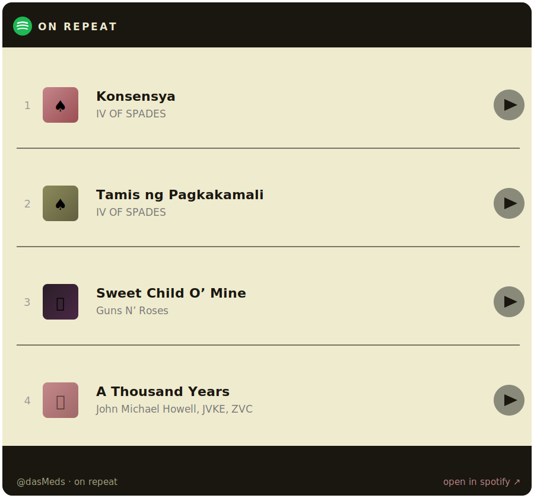

# Hey, I'm Pat Kristian Manalastas
### `@dasMeds` — Frontend Developer in Progress · Java Enthusiast · Creative Eye

---

## About Me

I'm a developer and creative from the Philippines, currently sharpening my craft on both the frontend and backend side of things. I love building things that look good **and** work well — whether that's a web interface, a Java desktop app, or a video edit.

- Currently refining my **HTML, CSS & JavaScript** skills — focused on clean, responsive, and interactive frontends
- Also leveling up in **Java** — I enjoy building desktop applications with Java Swing
- Amateur **video editor** with an eye for pacing, cuts, and visual storytelling
- **Photographer** and photo editor — I like making visuals that pop
- Based in the Philippines

---

## Languages

## Tools & Software

---

## Featured Projects

| Project | Description | Stack |
|---|---|---|
| [Currency Exchange Locator](https://github.com/dasMeds/Currency-Exchange-Locator) | Desktop app with interactive map, Euclidean distance evaluation & live exchange simulation | Java, Java Swing |
| [Global Currency App](https://github.com/dasMeds/Global-Currency-App) | Dark-themed app exploring 180+ world currencies with region filters & real-time conversion | Java, Java Swing |
| [Philippine Festivals Project](https://github.com/dasMeds/Philippine-Festivals-Project) | Catalogs PH cultural events by region with historical context & dark UI | Java, Java Swing |
| [Portfolio Website](https://github.com/dasMeds/dasmedsPortfolio.github.io) | Personal portfolio built with HTML, CSS & JS | HTML, CSS, JS |
| [House of Origami](https://github.com/dasMeds/House-of-Origami) | A creative HTML project | HTML |

---

## GitHub Stats

---

## On Repeat

---

## Beyond the Code

When I'm not writing code or pushing commits, you'll probably find me:

- Cutting and editing videos — I care a lot about how things *feel*, not just how they look
- Out with a camera — photography is how I see the world
- Editing photos and playing with visual composition
- Learning something new — currently deep in frontend fundamentals and Java OOP

---

*"You have power over your mind, not outside events. Realize this, and you will find strength."*

— Marcus Aurelius

